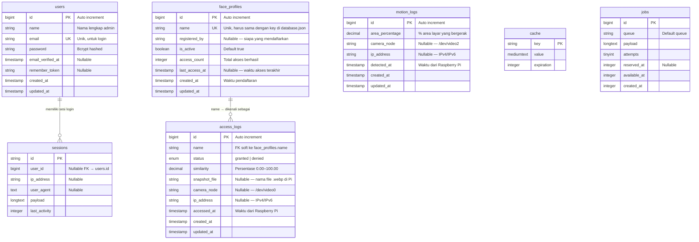

# Entity Relationship Diagram — HomeSafe

## Arsitektur Data

HomeSafe menggunakan dua lapisan penyimpanan yang bekerja bersama:

- **SQLite / MySQL (Laravel)** — metadata, log, dan sesi user untuk dashboard web
- **`database.json` (Raspberry Pi)** — embedding wajah 128-dimensi untuk engine OpenCV secara lokal

---

## ERD Diagram



---

## Penjelasan Relasi

| Relasi | Tipe | Keterangan |
|--------|------|------------|
| `users` → `sessions` | 1:N | Satu admin bisa punya banyak sesi login aktif |
| `face_profiles` → `access_logs` | 1:N | Satu profil wajah bisa punya banyak riwayat akses. Relasi via `name` (soft FK) karena embedding hidup di Pi terpisah |

---

## Soft Foreign Key: `face_profiles.name` ↔ `access_logs.name`

Tidak ada `FOREIGN KEY` constraint di database karena:

1. Profil wajah bisa **dihapus dari Pi** tanpa menghapus riwayat aksesnya di dashboard
2. `access_logs` juga menyimpan record untuk wajah **Unknown** (tidak terdaftar)
3. Key di `database.json` Pi adalah string name yang sama persis

```
database.json (Raspberry Pi)          SQLite / MySQL (Laravel)
─────────────────────────────          ────────────────────────────────
{                                      face_profiles
  "Wahyu": [ 0.12, -0.34, ... ],  ──►  id=1, name="Wahyu", ...
  "Budi":  [ 0.56,  0.78, ... ],  ──►  id=2, name="Budi", ...
}                                      
                                       access_logs
                                       id=1, name="Wahyu", status="granted"
                                       id=2, name="Wahyu", status="granted"
                                       id=3, name="Unknown", status="denied"
```

---

## Struktur Kolom Detail

### `users`
| Kolom | Tipe | Keterangan |
|-------|------|------------|
| `id` | BIGINT PK | Auto increment |
| `name` | VARCHAR(255) | Nama admin |
| `email` | VARCHAR(255) UNIQUE | Email login |
| `password` | VARCHAR(255) | Bcrypt hash |
| `email_verified_at` | TIMESTAMP NULL | Verifikasi email |
| `remember_token` | VARCHAR(100) NULL | Cookie remember me |
| `created_at` / `updated_at` | TIMESTAMP | Laravel timestamps |

### `face_profiles`
| Kolom | Tipe | Keterangan |
|-------|------|------------|
| `id` | BIGINT PK | Auto increment |
| `name` | VARCHAR(255) UNIQUE | **Harus sama** dengan key di `database.json` Pi |
| `registered_by` | VARCHAR(255) NULL | Nama admin yang mendaftarkan |
| `is_active` | BOOLEAN | `true` = boleh akses |
| `access_count` | INTEGER | Jumlah akses berhasil (counter) |
| `last_access_at` | TIMESTAMP NULL | Waktu akses terakhir |
| `created_at` | TIMESTAMP | Waktu pertama kali didaftarkan |
| `updated_at` | TIMESTAMP | |

### `access_logs`
| Kolom | Tipe | Keterangan |
|-------|------|------------|
| `id` | BIGINT PK | Auto increment |
| `name` | VARCHAR(255) | Nama yang dikenali / `"Unknown"` |
| `status` | ENUM | `granted` atau `denied` |
| `similarity` | DECIMAL(5,2) | Persentase kecocokan wajah (0–100) |
| `snapshot_file` | VARCHAR(255) NULL | Nama file `.webp` snapshot di Pi |
| `camera_node` | VARCHAR(255) NULL | Misal `/dev/video0` |
| `ip_address` | VARCHAR(45) NULL | IP Raspberry Pi |
| `accessed_at` | TIMESTAMP | Waktu akses terjadi di Pi |
| `created_at` / `updated_at` | TIMESTAMP | |
| **INDEX** | | `(name, accessed_at)`, `status`, `accessed_at` |

### `motion_logs`
| Kolom | Tipe | Keterangan |
|-------|------|------------|
| `id` | BIGINT PK | Auto increment |
| `area_percentage` | DECIMAL(5,2) | % piksel layar yang bergerak |
| `camera_node` | VARCHAR(255) NULL | Misal `/dev/video2` |
| `ip_address` | VARCHAR(45) NULL | IP Raspberry Pi |
| `detected_at` | TIMESTAMP | Waktu deteksi gerakan |
| `created_at` / `updated_at` | TIMESTAMP | |
| **INDEX** | | `detected_at` |

---

## Alur Data Sistem

```
┌─────────────────────────────────────────────────────────────────┐
│                      Raspberry Pi                                │
│                                                                  │
│  Camera ──► BlazeFace ──► SFace ──► database.json               │
│  (door)     (detect)     (embed)    { "Wahyu": [...128d] }       │
│                                                                  │
│  Camera ──► Motion Detect                                        │
│  (CCTV)                                                          │
│                                                                  │
│  FastAPI Backend — ws://pi:5001                                  │
│    /ws          → stream pengenalan wajah                        │
│    /ws/enroll   → pendaftaran wajah baru                         │
│    /ws/motion   → stream deteksi gerakan                         │
│    /api/history → riwayat akses (history.json)                   │
└──────────────────────┬──────────────────────────────────────────┘
                       │ WebSocket / REST API
                       ▼
┌─────────────────────────────────────────────────────────────────┐
│                  Laravel (Web Dashboard)                         │
│                                                                  │
│  Browser ◄──► Laravel ──► SQLite/MySQL                          │
│                             ├── users          (admin login)    │
│                             ├── face_profiles  (metadata)       │
│                             ├── access_logs    (riwayat akses)  │
│                             └── motion_logs    (riwayat gerak)  │
└─────────────────────────────────────────────────────────────────┘
```
